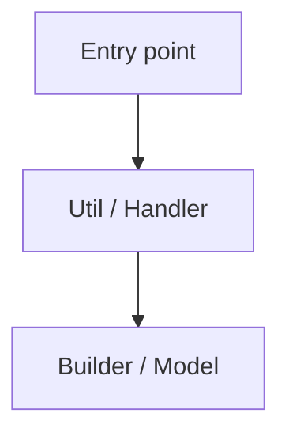
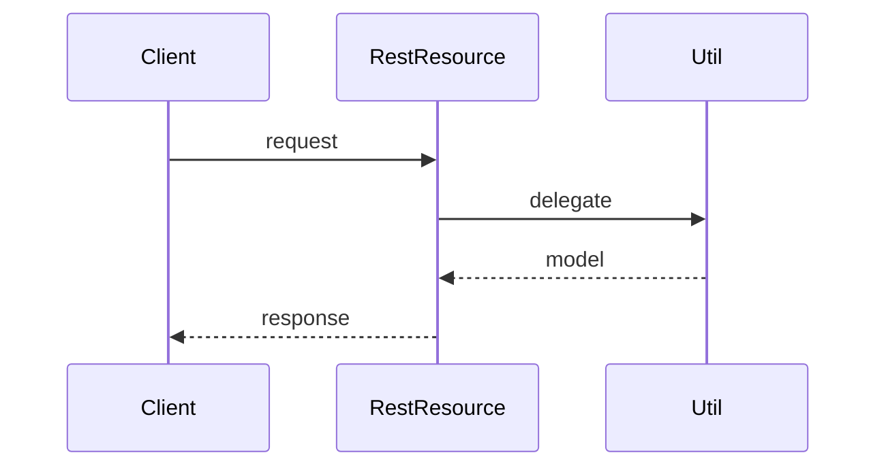
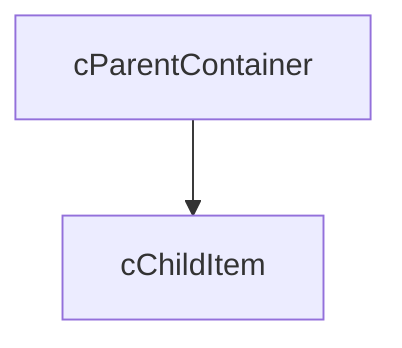

<!--
Traceability
Ticket: <TICKET-ID>
Artifact: technical-design.md
Gate: 2
Status: DRAFT | APPROVED
Requirements: ./requirements.md
Last updated: <YYYY-MM-DD>
-->

# Technical Design — <TICKET-ID>: <title>

## Summary
<One paragraph: what is being built and why. Chosen approach from exploration.>

## Requirements traceability
| Req # | Requirement | Addressed by (design section) |
|---|---|---|
| 1 | | |

## Architecture

<Layered: Trigger -> Handler -> Util -> Builder/Model, or RestResource -> Util -> Builder/Model.>

## Sequence

## LWC component hierarchy (if UI)

## Data model
- New / changed objects & fields (API name, type, relationships)
- OWD / sharing implications

## Apex design
| Class | <= 36 chars | Layer | Responsibility | New / modified |
|---|---|---|---|---|
| `<Name>` | ✅ | util | | new |

Method contracts:
- `Type ClassName.method(params)` — behavior, returns, errors thrown

## Governor limit analysis
| Operation | SOQL | DML | CPU | Callouts | Notes |
|---|---|---|---|---|---|
| <path> | | | | | at 200 records |

## Bulk operation strategy
<How 200-record contexts are handled; collection/map approach.>

## Sharing model impact
`with sharing` / `without sharing` (+ justification) per class.

## Metadata dependencies
- Custom Metadata Types, Permission Sets, Named Credentials, Platform Events required.

## REST API versioning strategy
<New `{Domain}RestResource_V[N]`? Existing versions untouched? Client migration?>

## Error handling
`ExceptionService.registerException(ex, 'Class.method')` + `ExceptionService.commitWork()`.

## Implementation order
`Metadata -> Models/Builders -> Utils -> TriggerHandlers -> RestResources -> Controllers -> LWC -> Tests`

## Risks & open questions
- <item>

## Sign-off
Design approved by: <name> on <date>
