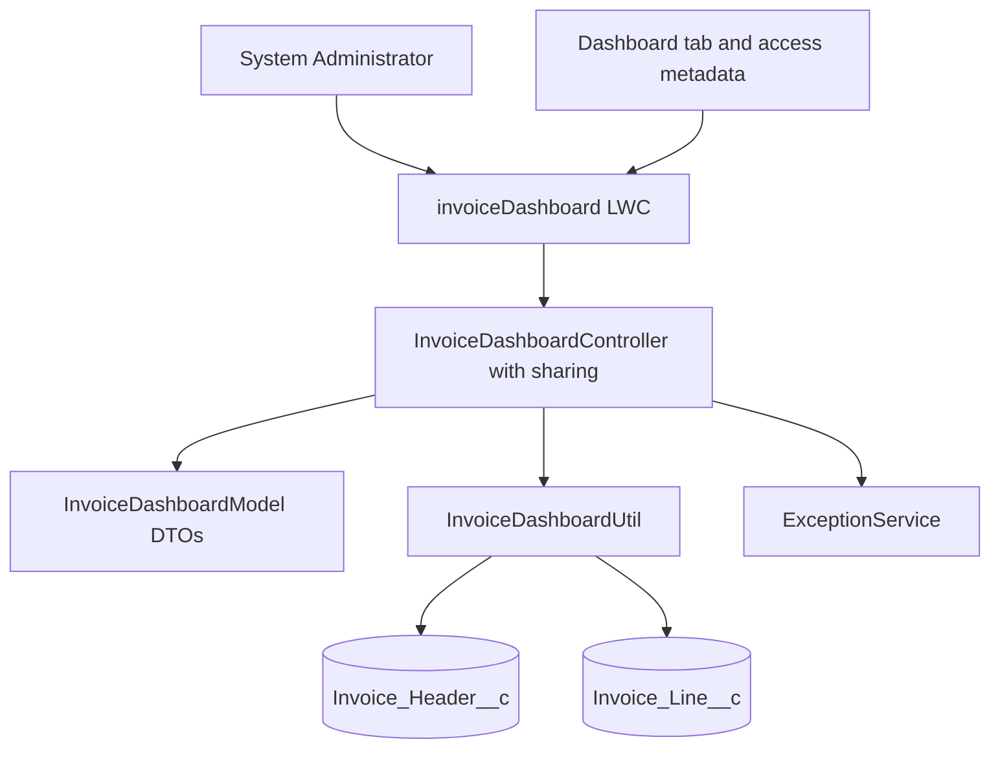
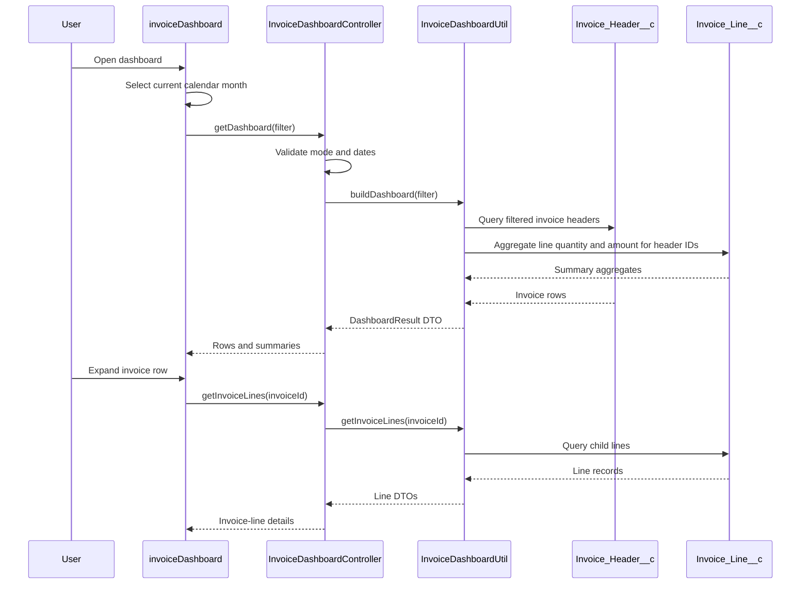
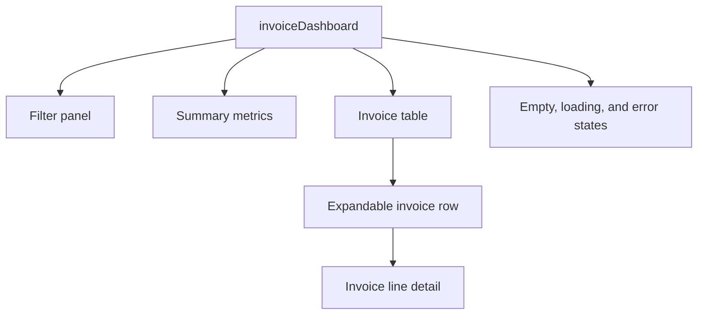

<!--
Traceability
Ticket: CRMFM-1
Artifact: technical-design.md
Gate: 2
Status: APPROVED
Requirements: ./requirements.md
Last updated: 2026-09-13
-->

# Technical Design — CRMFM-1: Invoice Dashboard LWC

## Summary

Build a read-only Invoice Dashboard LWC for System Administrators. The dashboard will filter
`Invoice_Header__c` records by invoice date and customer, return summary totals and invoice
rows through a service-backed Apex DTO, load `Invoice_Line__c` details lazily on expansion,
and export the loaded filtered rows as client-side CSV. The selected design is Option A from
`exploration.md`: thin controller, reusable utility, explicit DTOs, and no changes to invoice
creation or processing paths.

## Requirements traceability

| Req # | Requirement | Addressed by |
|---|---|---|
| 1 | Current reporting period selected by default | LWC default month initialization |
| 2 | Yearly filtering | `InvoiceDashboardUtil` date-range builder |
| 3 | Monthly filtering | `InvoiceDashboardUtil` date-range builder |
| 4 | Monday-Sunday weekly filtering | `InvoiceDashboardUtil` date-range builder |
| 5 | Inclusive custom date range | Controller validation and utility query |
| 6 | Customer filtering | Header query on `Account__c` |
| 7 | Filtered summaries and details | Dashboard result DTO |
| 8 | GBP display | LWC currency formatting with GBP context |
| 9 | Expand invoice lines | Lazy `getInvoiceLines` method |
| 10 | CSV export | LWC export of displayed rows |
| 11 | Empty state and zero summaries | Result DTO defaults and LWC state |
| 12 | Invalid date range validation | Controller validation before SOQL |
| 13 | User-friendly query errors | Handled Apex exception and LWC error state |
| 14 | System Administrator availability | Dedicated tab and access metadata |

## Architecture

The controller validates request shape and delegates all date construction, filtering,
aggregation, and mapping to the utility. DTOs prevent the LWC contract from exposing raw
SObjects unnecessarily. Existing invoice triggers and processing helpers are not modified.

## Sequence

## LWC component hierarchy

A single primary LWC is sufficient initially. Child components should only be introduced if
row rendering becomes difficult to test or maintain; the Apex contract remains independent
of that choice.

## Data model

- No new business objects or invoice fields.
- `Invoice_Header__c` is the primary read-only object.
- `Invoice_Header__c.Account__c` is the customer filter relationship.
- `Invoice_Header__c.Invoiced_Date__c` is the date filter field.
- Header display and summary fields include `InvoiceNo__c`, `Status__c`, `DueDate__c`,
  `AmountExclVAT__c`, `VAT__c`, `AmountInclVAT__c`, and `AmountOutstanding__c`.
- `Invoice_Line__c.Invoice_HeaderId__c` is the child relationship.
- Line display and aggregate fields include `Product_Name__c`, `Description__c`, `Qty__c`,
  `UnitPrice__c`, `Total_Price__c`, and `VAT__c`.
- Both invoice objects are deployed with sharing enabled and `ControlledByParent` sharing.
- Apex must enforce object and field access using the selected Salesforce security mechanism;
  the design should prefer `WITH USER_MODE` where supported by the target API version, or
  `WITH SECURITY_ENFORCED` plus appropriate sanitization where required by query shape.

## Apex design

| Class | <= 36 chars | Layer | Responsibility | New / modified |
|---|---|---|---|---|
| `InvoiceDashboardModel` | Yes | model | Filter, result, summary, row, and line DTOs | New |
| `InvoiceDashboardUtil` | Yes | util | Date ranges, validation, SOQL, aggregation, DTO mapping | New |
| `InvoiceDashboardController` | Yes | controller | `@AuraEnabled` validation/delegation boundary | New |
| `InvoiceDashboardControllerTest` | Yes | test | Controller and contract behavior | New |
| `InvoiceDashboardUtilTest` | Yes | test | Filtering, aggregation, validation, and line behavior | New |
| `invoiceDashboard` | Yes | LWC | Filters, table, states, CSV export | New |
| `invoiceDashboard.js-meta.xml` | N/A | metadata | Expose dashboard tab/page target | New |
| `ExceptionService` | Yes | shared service | Persist unexpected errors if no existing implementation is available | New only if required |

Method contracts:

- `InvoiceDashboardModel.DashboardResult InvoiceDashboardController.getDashboard(InvoiceDashboardModel.Filter filter)`
  validates the filter, delegates to the utility, and returns zero-valued summaries with an empty
  row list when no records match. It throws an `AuraHandledException` with a safe user-facing
  message for invalid input or query failure.
- `List<InvoiceDashboardModel.Line> InvoiceDashboardController.getInvoiceLines(Id invoiceId)`
  validates the ID, delegates to the utility, and returns child line DTOs in stable display order.
- `InvoiceDashboardModel.DashboardResult InvoiceDashboardUtil.buildDashboard(Filter filter)`
  constructs an inclusive date range, queries visible headers, aggregates visible lines for
  those headers, and maps records into DTOs.
- `List<InvoiceDashboardModel.Line> InvoiceDashboardUtil.getInvoiceLines(Id invoiceId)`
  queries visible child lines for one selected header and maps them to DTOs.

## Governor limit analysis

| Operation | SOQL | DML | CPU | Callouts | Notes |
|---|---:|---:|---|---:|---|
| Initial dashboard load | 2 | 0 | Standard synchronous | 0 | One header query and one grouped line query; no query in loops |
| Lazy line expansion | 1 | 0 | Standard synchronous | 0 | One invoice ID per call |
| Filter validation failure | 0 | 0 | Minimal | 0 | Rejected before querying |
| Client-side CSV export | 0 | 0 | Browser only | 0 | Uses rows already returned to the LWC |

The initial design assumes the filtered row set is bounded for an interactive dashboard. A
server-side pagination/export design is required if volume testing shows the result can exceed
LWC payload or synchronous Apex limits.

## Bulk operation strategy

This is a UI request path rather than a trigger context, so it does not process a 200-record
trigger batch. The utility still uses collection-safe logic: one header query, a `Set<Id>` of
header IDs, one grouped child query, and maps keyed by header ID. It must not perform SOQL or
DML inside loops. The test suite will create at least 200 invoice records where practical to
verify query shape and mapping behavior.

## Sharing model impact

`InvoiceDashboardController` and `InvoiceDashboardUtil` will be `with sharing`. The feature is
read-only and must respect the controlled-by-parent sharing model of both invoice objects. The
controller must not use `without sharing` to bypass invoice visibility. Object and field access
will be checked before returning values. UI profile checks are not the sole security boundary;
Apex sharing and FLS remain mandatory.

## Metadata dependencies

- New LWC bundle `invoiceDashboard`.
- New Lightning tab or equivalent exposed dashboard target.
- Access metadata restricted to System Administrators. Because the repository currently has no
  permission-set or tab directory, the exact metadata mechanism must be chosen before Gate 3:
  dedicated tab visibility, custom permission, or another deployable access artifact.
- No Custom Metadata Type, Custom Setting, Named Credential, Platform Event, or callout is needed.
- No schema changes are expected.
- If the project has no existing `ExceptionService`, add the smallest compatible service that
  records unexpected errors using the FM `ExceptionService.registerException` and
  `ExceptionService.commitWork` pattern; do not use `System.debug` for error logging.

## REST API versioning strategy

Not applicable. This feature exposes `@AuraEnabled` controller methods only and introduces no
REST resource. Existing versioned classes remain untouched. If a future external API is needed,
it must be introduced as a new versioned REST class rather than changing this controller into a
REST surface.

## Error handling

Validation errors are returned as safe handled Apex errors for display in the LWC. Unexpected
exceptions are registered with `ExceptionService.registerException(ex, 'Class.method')` and
committed with `ExceptionService.commitWork()`, then translated to a user-friendly message.
No raw exception details or sensitive field data are returned to the client. The LWC renders
loading, empty, validation, and query-error states without a full page reload.

## Implementation order

1. Metadata: confirm or add tab/access metadata; no invoice schema changes.
2. Models: add `InvoiceDashboardModel` DTOs.
3. Utils: add `InvoiceDashboardUtil` query, date, aggregation, and error logic.
4. Controllers: add `InvoiceDashboardController` delegation methods.
5. LWC: add `invoiceDashboard` bundle and client-side CSV export.
6. Tests: add one Apex test class per new production Apex class and focused LWC Jest tests.

## Risks & open questions

- Confirm whether the current calendar month remains the accepted default reporting period.
- Confirm expected maximum invoice count per filter before finalizing whether pagination is needed.
- Confirm the exact deployable mechanism for System Administrator-only tab access.
- Confirm whether the current org/API supports `WITH USER_MODE`; otherwise use the approved
  security-enforcement fallback.
- Confirm whether invoice line summary means `Qty__c` and `Total_Price__c` specifically.
- `ExceptionService` is not present in the current source tree and needs a Gate 3 decision on
  whether to add it or use an existing approved logging abstraction.

## Sign-off

Design approved by: rakeshchatty on 2026-09-13
