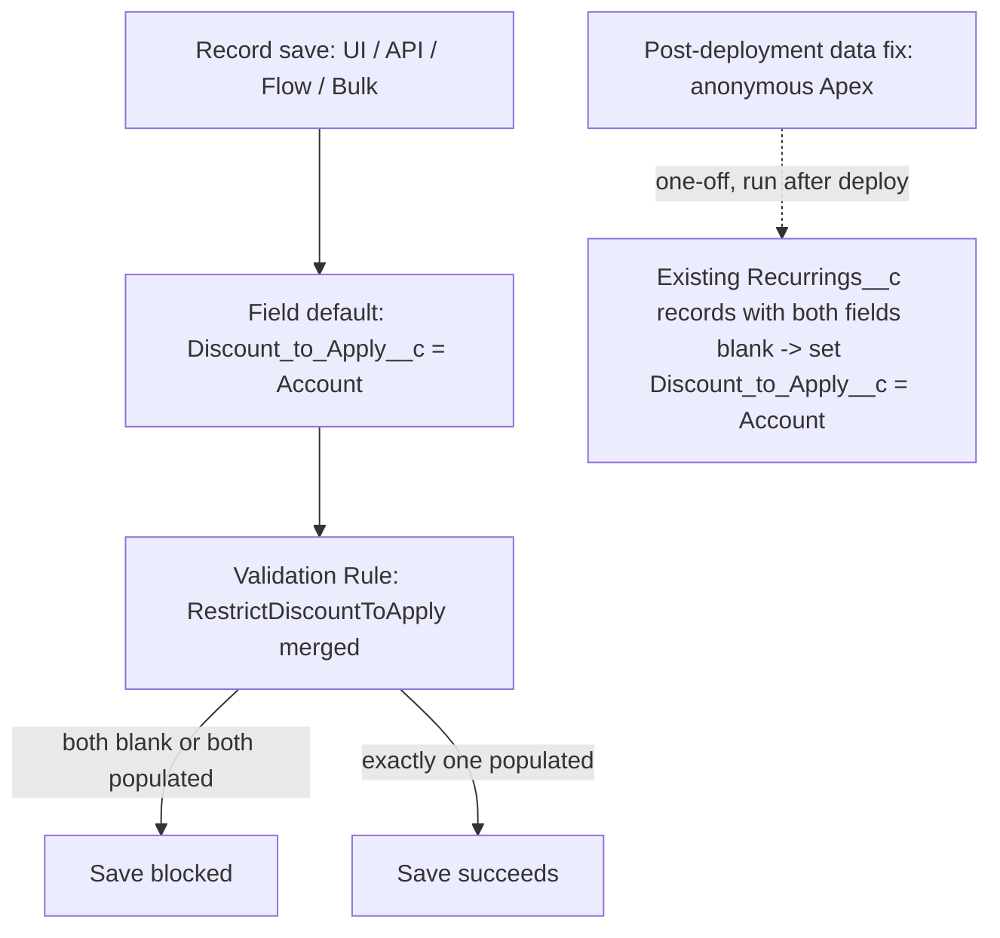
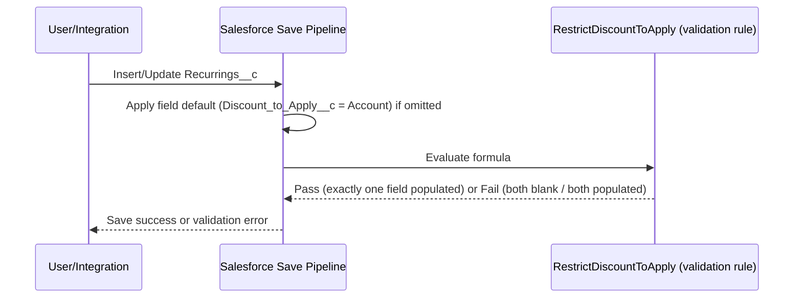

<!--
Traceability
Ticket: CRMFM-2
Artifact: technical-design.md
Gate: 2
Status: DRAFT
Requirements: ./requirements.md
Status: APPROVED
Last updated: 2026-09-21
-->

# Technical Design — CRMFM-2: Recurring Order - Default "Discount to Apply" to Account & enforce mutual-exclusivity validation with Manual Price

## Summary
Declarative-only fix (**Option A**, chosen by developer) on the `Recurrings__c` (Recurring
Order) object: rely on the existing `Discount_to_Apply__c` picklist field default
(`Account`) for manually-created records, and replace the existing
`RestrictDiscountToApply` validation rule with a single merged rule that blocks saving
unless **exactly one** of `ManualPrice__c` / `Discount_to_Apply__c` is populated (both
blank -> blocked; both populated -> blocked). A one-off post-deployment data-fix script
(anonymous Apex, referenced under `manifest/`) corrects existing records that currently
have both fields blank, so they pass the new rule going forward.

**Accepted risk:** this design does not add any new automation to force a default onto
records inserted via API, Bulk API, or Flow (e.g. `OrderHaulageTonnageOrLiftPriceService`)
that explicitly submit `Discount_to_Apply__c` as blank — those will be blocked by the new
validation rule at save time rather than silently defaulted. This was raised to the
developer and explicitly accepted.

## Requirements traceability
| Req # | Requirement | Addressed by (design section) |
|---|---|---|
| AC1 | Default to Account on new record w/ no value entered | Existing field default (`Discount_to_Apply__c.field-meta.xml`, unchanged) |
| AC2 | Block save when both blank | Merged validation rule |
| AC3 | Block save when both populated | Merged validation rule |
| AC4 | Allow save when exactly one populated | Merged validation rule |
| AC5 | Default works for automated/API paths | **Not met by Option A** — accepted risk, documented above |
| AC6 | Post-deployment data-fix for existing bad records | Anonymous Apex script under `manifest/` |

## Architecture

No Apex/Trigger/Handler layer introduced — purely declarative metadata (field default
already exists; validation rule updated) plus a one-off data-fix script. No RestResource /
Util / Builder layering applies here.

## Sequence


## LWC component hierarchy (if UI)
N/A — no UI changes.

## Data model
- No new objects or fields.
- `Recurrings__c.Discount_to_Apply__c` — no metadata change (default already set to `Account`).
- `Recurrings__c.ManualPrice__c` — no metadata change.
- No OWD / sharing changes.

## Apex design
No new or modified Apex classes for the validation/default logic (fully declarative).

| Component | Type | Path | Change |
|---|---|---|---|
| `RestrictDiscountToApply` | Validation Rule | `force-app/main/default/objects/Recurrings__c/validationRules/RestrictDiscountToApply.validationRule-meta.xml` | Modified — merged formula |
| Data-fix script | Anonymous Apex (`.apex`) | `manifest/CRMFM-2-datafix-discount-to-apply.apex` (new) | New — one-off post-deployment script |

**Merged validation rule formula:**
```
OR(
  AND(NOT(ISBLANK(ManualPrice__c)), NOT(ISBLANK(TEXT(Discount_to_Apply__c)))),
  AND(ISBLANK(ManualPrice__c), ISBLANK(TEXT(Discount_to_Apply__c)))
)
```
Error message: `"A Recurring Order must have either a Manual Price or a Discount to Apply, but not both and not neither."`
Error display field: `Discount_to_Apply__c` (consistent with existing rule).

**Data-fix script logic (anonymous Apex, run once via `sf apex run --file` against the
target org after deployment):**
```apex
List<Recurrings__c> toFix = [
    SELECT Id, Discount_to_Apply__c, ManualPrice__c
    FROM Recurrings__c
    WHERE ManualPrice__c = null AND Discount_to_Apply__c = null
];
for (Recurrings__c r : toFix) {
    r.Discount_to_Apply__c = 'Account';
}
if (!toFix.isEmpty()) {
    update toFix;
}
System.debug('CRMFM-2 data fix: updated ' + toFix.size() + ' Recurrings__c records.');
```
Bulk-safe (single SOQL, single DML). Idempotent — re-running finds zero matching records
once fixed. Referenced from `manifest/` per developer's request (script file lives under
`manifest/`, not deployed as metadata).

## Governor limit analysis
| Operation | SOQL | DML | CPU | Callouts | Notes |
|---|---|---|---|---|---|
| Insert/update Recurrings__c (validation rule eval) | 0 | 0 | negligible | 0 | Declarative, no additional limit consumption vs. today |
| Data-fix script (one-off) | 1 | 1 | proportional to record count | 0 | Run once; if existing bad-record volume exceeds ~10k, batch via `Database.executeBatch` instead of a single anonymous script — to confirm actual volume before running |

## Bulk operation strategy
Validation rule evaluates per-record at save time regardless of batch size — no change in
behavior for bulk inserts/updates (200+ records) versus today. Data-fix script uses a
single SOQL query + single bulk DML `update` statement, safe for any result-set size within
standard governor limits; if volume is large, will convert to a batch class before running
in the target org (to confirm row count during Gate 5/6).

## Sharing model impact
N/A — no Apex classes introduced; validation rules and data-fix script run in system
context (anonymous Apex runs as the executing user, respecting their permissions/sharing
unless run via an admin session — standard for one-off data fixes).

## Metadata dependencies
- None. No Custom Metadata Types, Permission Sets, or Named Credentials required.

## REST API versioning strategy
N/A — no Apex REST resources involved.

## Error handling
N/A for the declarative save-time enforcement — the validation rule surfaces its own
`errorMessage` directly to the user/API caller. The data-fix script is a one-off manual
run, not a scheduled/batch job, so `ExceptionService` logging pattern does not apply; any
failure will surface directly in the anonymous Apex execution log when run.

## Implementation order
1. Update `RestrictDiscountToApply` validation rule (merged formula).
2. Verify `Discount_to_Apply__c` field default metadata is unchanged/correct (no edit expected).
3. Write the post-deployment data-fix anonymous Apex script under `manifest/`.
4. Update/extend `RecurringTest.cls` (or add a focused test) to cover the new validation rule scenarios via `insert`/`update` DML in a test class (validation rules are exercised through normal DML, not called directly).
5. Deploy to dev sandbox (Gate 6), execute the data-fix script there, verify.

## Risks & open questions
- **Accepted risk:** Discount to Apply is not force-defaulted for records submitted via
  API/Bulk/Flow with an explicit blank value (e.g. `OrderHaulageTonnageOrLiftPriceService`)
  — those records will now be **blocked from saving** by the merged validation rule rather
  than silently defaulted. This changes behavior from "silently wrong" to "loudly blocked,"
  which is an improvement, but users/integrations hitting this flow will need to explicitly
  choose a Discount to Apply value or a Manual Price to save successfully going forward.
- Data-fix script volume unknown — to confirm record count in the dev sandbox before
  running in Gate 6, and decide if a batch class is needed for very large volumes.
- The existing `RestrictDiscountToApply` rule name will be kept (formula merged in place)
  to preserve the metadata's history rather than deactivating/creating a new rule — to
  confirm this is acceptable rather than creating a new rule.

## Sign-off
Design approved by: developer on 2026-09-21
