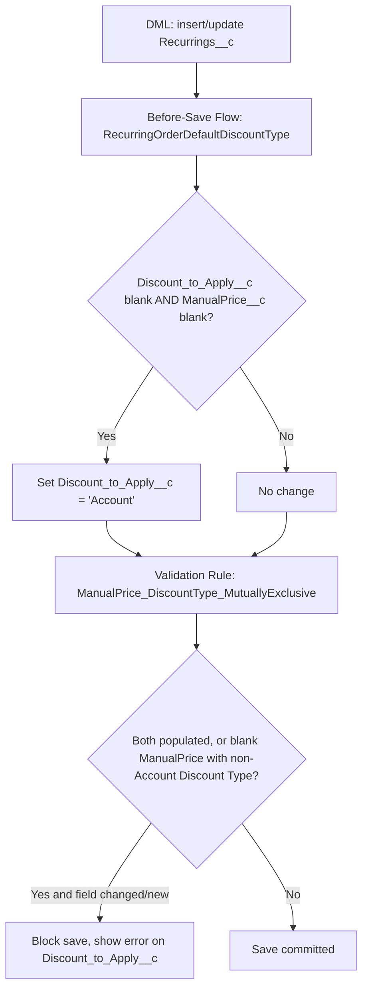
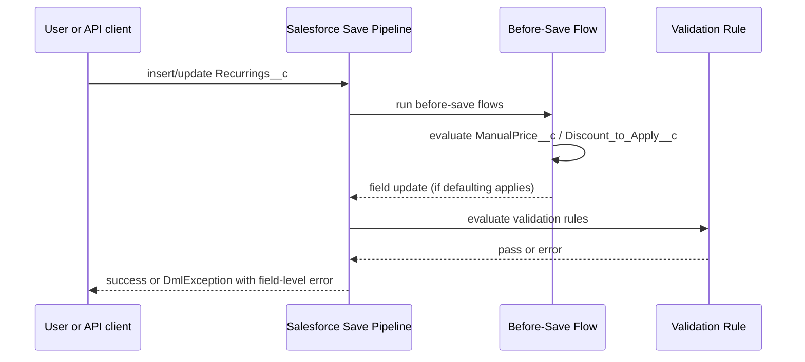

<!--
Traceability
Ticket: CRMFM-7
Artifact: technical-design.md
Gate: 2
Status: APPROVED
Requirements: ./requirements.md
Last updated: 2026-09-30
-->

# Technical Design — CRMFM-7: Default Discount Type and enforce manual pricing rules on Recurring Orders

## Summary
This is a **pure declarative metadata change** on the existing `Recurrings__c` (Recurring
Order) object — no Apex, no LWC, no REST surface. Per Gate 2 exploration (`exploration.md`,
Option A):

1. A new **Before-Save Record-Triggered Flow** (`RecurringOrderDefaultDiscountType`)
   defaults `Discount_to_Apply__c` to `Account` whenever both it and `ManualPrice__c` are
   blank at save time — covering every creation path (UI, API, data load), unlike the
   pre-existing picklist-level default which only applies in the UI layout.
2. A new **Validation Rule** (`ManualPrice_DiscountType_MutuallyExclusive`) enforces that
   `ManualPrice__c` and `Discount_to_Apply__c` are never both populated, and that when
   `ManualPrice__c` is blank, `Discount_to_Apply__c` may only be blank or `Account`. It is
   scoped to fire only when relevant fields change, so pre-existing non-compliant records
   are not newly blocked on unrelated edits.

## Requirements traceability
| Req # | Requirement | Addressed by (design section) |
|---|---|---|
| AC1 | New record, Manual Price blank, no explicit Discount Type -> defaults to Account | Before-Save Flow |
| AC2 | Manual Price blank, Discount Type = Account -> save succeeds | Validation Rule (no error condition met) |
| AC3 | Manual Price populated + Discount Type populated -> blocked | Validation Rule, condition 1 |
| AC4 | Manual Price populated, Discount Type blank -> save succeeds | Validation Rule (no error condition met) |
| AC5 | Manual Price blank, Discount Type != Account (non-blank) -> blocked | Validation Rule, condition 2 |
| AC6 | Existing non-compliant record, unrelated edit -> not newly blocked | Validation Rule `ISCHANGED()` scoping |
| AC7 | Clear, field-specific error messages | Validation Rule `errorMessage` + `errorDisplayField` |

## Architecture

Declarative metadata only — no Apex layer is introduced. FM's
`RestResource -> Util/Handler -> Builder/Model` layering does not apply since there is no
REST/Apex surface in this change.

## Sequence


## LWC component hierarchy (if UI)
N/A — no LWC/UI changes in scope.

## Data model
- No new objects or fields. Existing fields used as-is:
  - `Recurrings__c.Discount_to_Apply__c` (Picklist: `Account`, `Partner`; restricted)
  - `Recurrings__c.ManualPrice__c` (Currency 18,2)
- OWD / sharing: not applicable — no Apex, no new object, no sharing changes.

## Apex design
N/A — no Apex classes are created or modified. (`RecurringTriggerHelper` was reviewed in
Gate 2 exploration as a possible alternative — see `exploration.md` Option B — but is not
touched by the chosen approach.)

## Governor limit analysis
| Operation | SOQL | DML | CPU | Callouts | Notes |
|---|---|---|---|---|---|
| Insert/update Recurrings__c (per record, incl. 200-record bulk) | 0 | 0 | negligible | 0 | Flow and Validation Rule evaluate against the in-memory record only; no queries or DML performed by this change. |

## Bulk operation strategy
Both a Before-Save Flow and a Validation Rule are evaluated by the platform natively,
per-record, within the same transaction as the triggering DML — they are inherently
bulk-safe up to and beyond the standard 200-record trigger batch with zero additional
SOQL/DML from this change. No collection/map handling is required since no Apex is
introduced.

## Sharing model impact
N/A — no Apex classes introduced.

## Metadata dependencies
- New Flow: `RecurringOrderDefaultDiscountType` (Before-Save, Record-Triggered, object
  `Recurrings__c`, `recordTriggerType: CreateAndUpdate`) — mirrors
  `OrderProductBeforeSave.flow-meta.xml` structurally.
- New Validation Rule: `ManualPrice_DiscountType_MutuallyExclusive` on `Recurrings__c`.
- No Custom Metadata Types, Permission Sets, or Named Credentials required.

### Validation rule formula (design-level; finalized in specs.md)
```
AND(
  OR(
    NOT(ISNEW()),
    ISCHANGED(ManualPrice__c),
    ISCHANGED(Discount_to_Apply__c)
  ),
  OR(
    AND(NOT(ISBLANK(TEXT(ManualPrice__c... )))  /* see specs.md for exact ISBLANK on currency */,
        NOT(ISBLANK(Discount_to_Apply__c))),
    AND(ISBLANK(ManualPrice__c),
        NOT(ISBLANK(Discount_to_Apply__c)),
        NOT(ISPICKVAL(Discount_to_Apply__c, 'Account')))
  )
)
```
Note: `ISNEW()` is always true on insert, so the `OR(NOT(ISNEW()), ISCHANGED(...), ISCHANGED(...))`
guard is logically always true on insert (correct — new records must always be validated)
and only restricts re-evaluation on update to cases where the two relevant fields actually
changed. Exact formula syntax (currency-field blank check, picklist blank check) is
finalized in `specs.md`.

## REST API versioning strategy
N/A — no REST resources in scope.

## Error handling
Errors surface as standard Salesforce validation-rule errors (`DmlException` on the
`Discount_to_Apply__c` field, via `errorDisplayField`), not via `ExceptionService` — that
pattern is for Apex-thrown/handled exceptions and does not apply to platform-native
Validation Rule failures.

## Implementation order
Adapted FM order for this declarative-only change:
`Metadata (Validation Rule) -> Flow -> Tests (Apex assertions on DML behavior)`
(No Models/Builders/Utils/TriggerHandlers/RestResources/Controllers/LWC — not applicable.)

## Risks & open questions
- Exact Salesforce formula syntax for "is blank" on a Currency field
  (`ISBLANK(ManualPrice__c)` works directly for number/currency fields, unlike text) and for
  the picklist comparison (`ISPICKVAL`) will be finalized and verified in `specs.md` /
  during implementation — no functional ambiguity, just syntax to confirm against the org.
- Two new metadata artifacts (Flow + Validation Rule) must both deploy together — sequencing
  is trivial since neither depends on the other's existence to deploy, but both are needed
  together for full acceptance-criteria coverage.
- Confirmed no other declarative automation (Process Builder, other flows) currently exists
  on `Recurrings__c` for these two fields that could conflict with the new Flow.

## Sign-off
Design approved by: rakeshchatty on 2026-09-30
